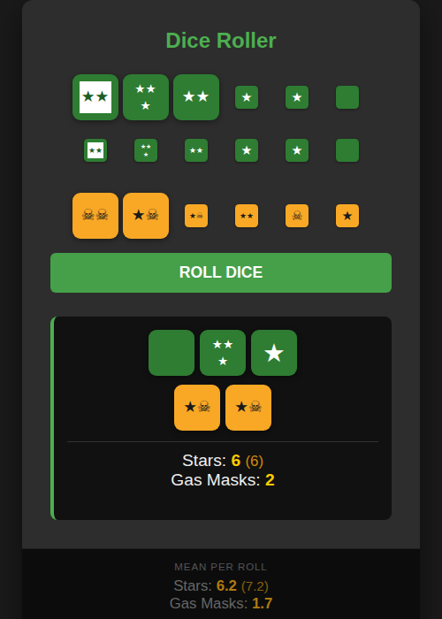

# stalkerdice
Dice Roller for the STALKER board game.

▶ **[Launch](https://felixdombek.github.io/stalkerdice/)**

## Features

- **Select dice** – click a green or yellow die in the selector rows to choose how many dice to roll; the dice scale up to show your selection
- **Unselect** – click the same die again to deselect that count and clear the selection
- **Roll** – press **ROLL DICE** to roll all selected dice and see the results with ★ / ☠ symbols
- **Fix dice for reroll** – after rolling, click any result die to mark it for rerolling (others fade out); press **REROLL SELECTED** to reroll only those dice
- **Deselect reroll** – press **✕** to clear the reroll selection without rerolling
- **Weighted results** – the special green ★★ face (white inner square) counts as extra stars when in optimum weapon range; both the raw and weighted star totals are shown
- **Expected-value bar** – the panel at the bottom shows the mean stars and gas masks per roll for the current dice pool
- **Works offline** – installable as a PWA; no internet connection required at the table

